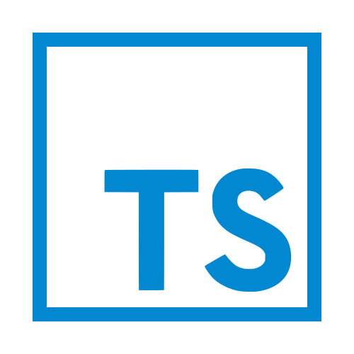

# Portfolio - Luciano Lima

## Tecnologias utilizadas

Este projeto utiliza as seguintes tecnologias:

- [React](https://reactjs.org/): Biblioteca JavaScript de código aberto para construção de interfaces de usuário.
- [TypeScript](https://www.typescriptlang.org/): Superset do JavaScript que adiciona tipagem estática opcional.
- [Vite](https://vitejs.dev/) Ferramentas de construção para projetos web com React.
- [Vitest](https://vitest.dev/): Framework de teste em JavaScript.
- [TailwindCSS](https://tailwindcss.com/): Framework CSS utilitário para criação de designs personalizados.

## Como rodar o projeto

Para rodar o projeto, siga os passos abaixo:

1. Certifique-se de ter o Node.js instalado em sua máquina. Você pode baixá-lo em: [https://nodejs.org/](https://nodejs.org/).

2. Clone o repositório do projeto:

   ```bash
   git clone url-do-projeto
   ```

3. Acesse o diretório do projeto:

   ```bash
   cd nome-do-projeto
   ```

4. Instale as dependências do projeto:

   ```bash
   npm install
   ```

5. Inicie o servidor de desenvolvimento:

   ```bash
   npm run dev
   ```

   Isso iniciará o servidor de desenvolvimento do Vite, que compilará o código e abrirá o aplicativo no seu navegador. Qualquer alteração que você fizer nos arquivos será refletida automaticamente no navegador.

## Estrutura de Pastas

- **node_modules**: 
  Pasta que contém as dependências do projeto instaladas pelo npm ou yarn. É uma pasta gerada automaticamente, não altere nenhum arquivo
- **public**:  Pasta que contém arquivos públicos que serão copiados para a pasta de build final.
- **src**:  Pasta raiz do código-fonte do projeto.

  - **assets**:  Pasta que contém arquivos estáticos, como imagens, icones, etc.
  - **components**:  Pasta que contém componentes reutilizáveis.

    - **Footer**: 📂 pasta com todos os arquivos relacionados ao componente.

      - **Footer.test.tsx**:  contem os testes do componente (caso não seja um componente com necessidades de testes, não crie).
      - **index.tsx**:  contem o "html" do componente.
      - **styles.css**:  contem a estilização do componente.
      - **useFooter.tsx**:  contem a lógica embarcada no componente, deve ser escrito com a estrutura de um react hook (caso não seja um componente de lógica, não crie).
      - **Footer.types.d.tsx**:  contem a tipagem do componente.

    - **shared**:  Pasta que contém componentes compartilhados entre diferentes partes da aplicação. **_Deve conter componentes com a mesma estrutura do exemplo Footer acima._**

  - **hooks**:  Pasta que contém hooks personalizados.
    - **useAuth.tsx**:  Arquivo exemplo de como nomear um hooks, sempre com o "use" na frente.
  - **pages**:  Pasta que contém as páginas da aplicação.
  - **app.css**:  Arquivo de estilo CSS específico para o componente raiz da aplicação.
  - **app.tsx**:  Arquivo que contém o componente raiz da aplicação.
  - **index.css**:  Arquivo de estilo CSS global.
  - **main.tsx**:  Arquivo principal que renderiza o componente raiz da aplicação.

- **eslint.cjs**:  Arquivo de configuração do ESLint, uma ferramenta de formatação única de código.
- **gitignore**:  Arquivo que lista os arquivos e pastas que devem ser ignorados pelo controle de versão do Git.
- **index.html**:  Arquivo HTML principal da aplicação.
- **package.json**:  Arquivo de manifesto do projeto, que contém informações sobre as dependências e scripts de build, entre outros.
- **postcss.config.js**:  Arquivo de configuração do PostCSS.
- **README.md**:  Este arquivo, contendo informações sobre o projeto e sua estrutura.
- **tailwind.config.js**:  Arquivo de configuração do Tailwind CSS, um framework de estilos utilitários.
- **tsconfig.json**:  Arquivo de configuração do TypeScript, contendo opções de compilação e tipo.
- **vite.config.ts**:  Arquivo de configuração do Vite, um compilador e servidor de desenvolvimento rápido para projet
